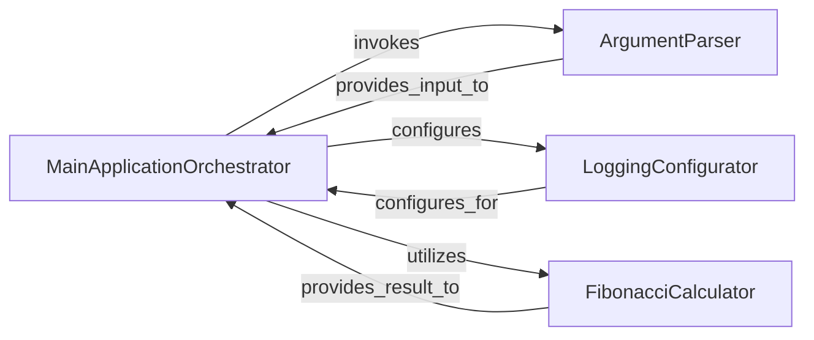

## Component Details

This project's subsystem is composed of four fundamental components, each with a distinct responsibility, working together to achieve the application's goal of calculating and displaying Fibonacci numbers based on user input. These components were chosen because they represent logical, cohesive units of functionality as observed in the source code.

### MainApplicationOrchestrator

The central control unit of the application, responsible for orchestrating the overall execution flow. It sequentially invokes the ArgumentParser to process command-line arguments, the LoggingConfigurator to set up logging, and the FibonacciCalculator to perform the core business logic. Finally, it prints the calculated result. It acts as the primary coordinator, directing the flow of operations.

**Related Classes/Methods**:

- <a href="https://github.com/os-climate/python-template-repository/blob/master/content/skeleton.py#L0-L0" target="_blank" rel="noopener noreferrer">`content.skeleton.main` (0:0)</a>

### ArgumentParser

Handles the parsing of command-line arguments provided to the application. It defines and processes expected arguments, such as the integer n for Fibonacci calculation and the verbosity level for logging, ensuring that the application receives valid and structured input.

**Related Classes/Methods**:

- <a href="https://github.com/os-climate/python-template-repository/blob/master/content/skeleton.py#L0-L0" target="_blank" rel="noopener noreferrer">`content.skeleton.parse_args` (0:0)</a>

### LoggingConfigurator

Configures the application's logging system. This includes setting the logging level (e.g., DEBUG, INFO), specifying the output stream (standard output), and defining the format of log messages. Its role is crucial for providing visibility into the application's execution and debugging.

**Related Classes/Methods**:

- <a href="https://github.com/os-climate/python-template-repository/blob/master/content/skeleton.py#L0-L0" target="_blank" rel="noopener noreferrer">`content.skeleton.setup_logging` (0:0)</a>

### FibonacciCalculator

Encapsulates the core business logic for computing the n-th Fibonacci number. It includes validation to ensure that the input n is a positive integer, guaranteeing the correctness of the calculation. This component is the heart of the application's computational capability.

**Related Classes/Methods**:

- <a href="https://github.com/os-climate/python-template-repository/blob/master/content/skeleton.py#L0-L0" target="_blank" rel="noopener noreferrer">`content.skeleton.fib` (0:0)</a>

### [FAQ](https://github.com/CodeBoarding/GeneratedOnBoardings/tree/main?tab=readme-ov-file#faq)