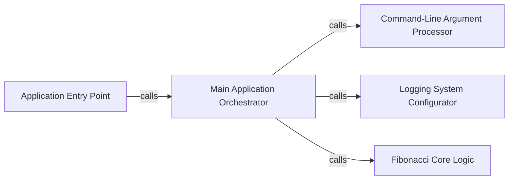

## Component Details

Based on the Control Flow Graph (CFG) analysis and the Source analysis, the `python-template-repository` project exhibits a clear, linear flow of execution with well-defined responsibilities. The critical interaction pathways revolve around a central orchestrator function that coordinates argument parsing, logging setup, and the core business logic.

### Application Entry Point

This is the highest-level component, serving as the initial point of execution for the entire application. Its sole responsibility is to kick off the main application logic. It acts as the gateway for the application's execution.

**Related Classes/Methods**:

- <a href="https://github.com/os-climate/python-template-repository/blob/master/content/skeleton.py#L1-L1" target="_blank" rel="noopener noreferrer">`content.skeleton.run` (1:1)</a>

### Main Application Orchestrator

The central control unit of the application. It coordinates the execution flow by sequentially calling other components to handle argument parsing, logging setup, and the core business logic. It is the brain that directs the overall operation.

**Related Classes/Methods**:

- <a href="https://github.com/os-climate/python-template-repository/blob/master/content/skeleton.py#L1-L1" target="_blank" rel="noopener noreferrer">`content.skeleton.main` (1:1)</a>

### Command-Line Argument Processor

This component is dedicated to processing command-line arguments provided by the user. It defines the expected arguments (like the Fibonacci number `n` and verbosity levels) and parses them into a usable format for the application.

**Related Classes/Methods**:

- <a href="https://github.com/os-climate/python-template-repository/blob/master/content/skeleton.py#L1-L1" target="_blank" rel="noopener noreferrer">`content.skeleton.parse_args` (1:1)</a>

### Logging System Configurator

This component is responsible for setting up and configuring the application's logging system. It determines the log level, format, and output stream for messages, which is crucial for debugging and monitoring the application's behavior.

**Related Classes/Methods**:

- <a href="https://github.com/os-climate/python-template-repository/blob/master/content/skeleton.py#L1-L1" target="_blank" rel="noopener noreferrer">`content.skeleton.setup_logging` (1:1)</a>

### Fibonacci Core Logic

This component encapsulates the core business logic of the application: calculating the n-th Fibonacci number. It is a pure function, performing a specific computation that represents the primary purpose of the application.

**Related Classes/Methods**:

- <a href="https://github.com/os-climate/python-template-repository/blob/master/content/skeleton.py#L1-L1" target="_blank" rel="noopener noreferrer">`content.skeleton.fib` (1:1)</a>

### [FAQ](https://github.com/CodeBoarding/GeneratedOnBoardings/tree/main?tab=readme-ov-file#faq)